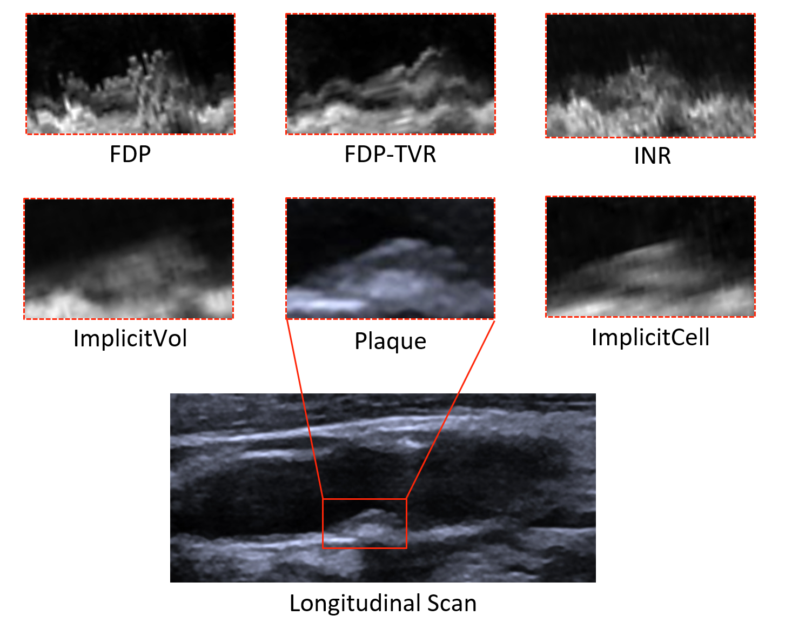
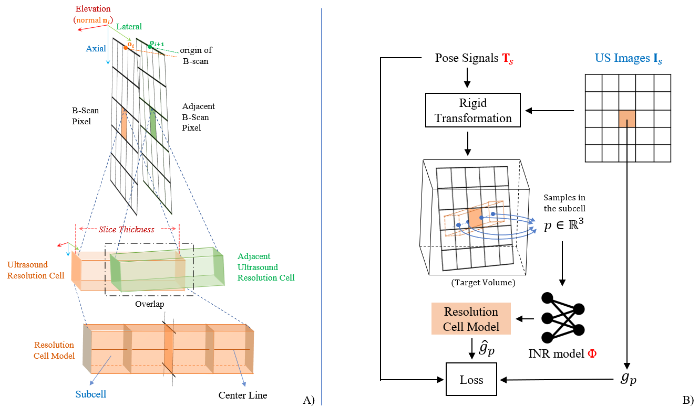

# ImplicitCell: Resolution Cell Modeling of Joint Implicit Volume Reconstruction and Pose Refinement in Freehand 3D Ultrasound

Our paper is currently undergoing peer review. The code, dataset, and application will be released once the paper is accepted.

## Framework

## Acknowledgments
We would like to acknowledge the following awesome prior work:

- [Total Variation Regularization of Pose Signals With an Application to 3D Freehand Ultrasound](https://github.com/IFL-CAMP/pose_regularization)
- [Tiny CUDA NN](https://github.com/NVlabs/tiny-cuda-nn)
- [ImplicitVol](https://github.com/pakheiyeung/ImplicitVol)
- [BARF](https://github.com/chenhsuanlin/bundle-adjusting-NeRF)
- [Parallel Inversion NeRF](https://github.com/NVlabs/ParallelInversion)
- [iSegFormer](https://github.com/uncbiag/iSegFormer)